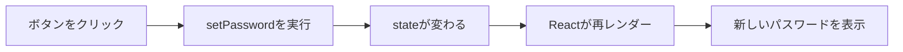

# Password Studioで学ぶReact入門

この資料は、今回作成した「Password Studio」のコードを題材に、Reactを初めて学ぶ人向けに処理の流れを説明します。

最初からすべて暗記する必要はありません。まずは、次の1点を覚えてください。

> Reactでは、データである「state」が変わると、画面が自動的に更新される。

---

## 1. このアプリは何でできているか

今回のアプリでは、主に次の技術を使用しています。

| 技術 | 担当するもの |
|---|---|
| React | 画面の表示と、画面内のデータ管理 |
| TypeScript | データの型を確認し、コードの間違いを減らす |
| CSS | 色、余白、配置などのデザイン |
| Vite | 開発サーバーの起動と、公開用ファイルの作成 |
| Web Crypto API | 安全性を考慮したランダム値の生成 |
| Local Storage API | ブラウザ内へのデータ保存 |

Web Crypto APIとLocal Storage APIはReactの機能ではなく、ブラウザが提供している機能です。Reactからブラウザの機能を呼び出して使用しています。

## 2. 最初に見るファイル

```text
転職ポートフォリオ/
├─ index.html          Reactを表示する土台
├─ src/
│  ├─ main.tsx         Reactをindex.htmlへ接続する入口
│  ├─ App.tsx          画面と主な処理
│  └─ index.css        画面のデザイン
├─ package.json        使用パッケージとコマンドの設定
└─ vite.config.ts      Viteの設定
```

今回、最も重要なのは`src/App.tsx`です。

読む順番は次がおすすめです。

1. `main.tsx`
2. `App.tsx`の`return`部分
3. `useState`
4. ボタンの`onClick`
5. `generatePassword`などの処理
6. `useEffect`

## 3. Reactが画面に表示されるまで

### index.html

```html
<div id="root"></div>
```

この`div`は、Reactの画面を入れる空の箱です。

### main.tsx

```tsx
createRoot(document.getElementById('root')!).render(
  <StrictMode>
    <App />
  </StrictMode>,
)
```

処理を日本語にすると、次のようになります。

1. HTMLから`id="root"`の要素を探す
2. その要素をReactの表示場所にする
3. `App`コンポーネントを表示する

`<App />`はHTMLの独自タグに見えますが、実際には`App.tsx`にある`App`関数を呼び出しています。

`StrictMode`は開発中に問題を見つけやすくする機能です。本番画面へ余計な要素を表示するものではありません。

## 4. コンポーネントとは

コンポーネントとは、画面を構成する部品です。今回のアプリ全体は`App`というコンポーネントになっています。

```tsx
function App() {
  // データと処理

  return (
    // 表示する画面
  )
}
```

通常の関数との大きな違いは、戻り値として画面の構造を返すことです。

今回のアプリは小さいため、ほとんどを`App`にまとめています。規模が大きくなったら、次のように分割できます。

```text
App
├─ PasswordOptions
├─ GeneratedPassword
└─ SavedPasswordList
   └─ SavedPasswordItem
```

## 5. JSXとは

Reactの関数内には、HTMLに似た記述があります。これをJSXと呼びます。

```tsx
<h1>Password Studio</h1>
```

JSXでは、波括弧`{ }`の中にJavaScriptの値や式を書けます。

```tsx
<output>{options.length}</output>
```

この例では、`options.length`の現在値が画面に表示されます。

HTMLとの主な違いは次のとおりです。

| HTML | JSX |
|---|---|
| `class` | `className` |
| `for` | `htmlFor` |
| `onclick` | `onClick` |
| `checked="checked"` | `checked={真偽値}` |

JSXは見た目がHTMLに近いだけで、TypeScriptファイル内に書かれたJavaScriptの一部です。

## 6. state：Reactで最も重要な考え方

stateは、画面内で変化するデータです。今回のアプリでは`useState`を使って管理しています。

```tsx
const [password, setPassword] = useState('')
```

それぞれの意味は次のとおりです。

| 名前 | 意味 |
|---|---|
| `password` | 現在のパスワード |
| `setPassword` | パスワードを変更する関数 |
| `useState('')` | 初期値は空文字 |

次のように変更します。

```tsx
setPassword('Abcd1234!')
```

`setPassword`が呼ばれると、Reactは`App`をもう一度評価します。その結果、新しい`password`を使った画面が表示されます。DOMを自分で探して文字を書き換える必要はありません。



### 今回使用しているstate

```tsx
const [options, setOptions] = useState(...)
const [password, setPassword] = useState('')
const [label, setLabel] = useState('')
const [savedPasswords, setSavedPasswords] = useState(...)
const [visibleIds, setVisibleIds] = useState(...)
const [message, setMessage] = useState('')
```

| state | 保存しているもの |
|---|---|
| `options` | 文字数やチェックボックスの状態 |
| `password` | 生成されたパスワード |
| `label` | 保存時に入力する用途名 |
| `savedPasswords` | 保存済みパスワードの配列 |
| `visibleIds` | 現在パスワードを表示している項目のID |
| `message` | 画面右下に表示する通知文 |

### stateを直接変更してはいけない

次のように直接代入してはいけません。

```tsx
// 悪い例
password = 'Abcd1234!'
```

Reactは専用の更新関数が呼ばれたことをきっかけに画面を更新します。そのため、必ず`setPassword`などを使います。

## 7. 入力項目とstateを接続する

文字数のスライダーでは、現在値と変更処理を指定しています。

```tsx
<input
  type="range"
  value={options.length}
  onChange={(event) =>
    setOptions({ ...options, length: Number(event.target.value) })
  }
/>
```

処理の流れは次のとおりです。

1. `value`に現在の文字数を渡す
2. ユーザーがスライダーを動かす
3. `onChange`が実行される
4. `event.target.value`から入力値を取得する
5. `setOptions`でstateを更新する
6. Reactが新しい文字数を表示する

`event.target.value`は文字列なので、`Number()`で数値へ変換しています。

### `...options`の意味

```tsx
setOptions({ ...options, length: 20 })
```

`...options`は、現在の`options`の内容を新しいオブジェクトへコピーします。その後、`length`だけを新しい値で上書きします。

```ts
{
  uppercase: true,
  lowercase: true,
  numbers: true,
  symbols: true,
  excludeSimilar: true,
  customWord: '',
  length: 20,
}
```

Reactでは、元のオブジェクトを直接変更せず、新しいオブジェクトを作ってstateへ渡すのが基本です。

## 8. イベント処理

ボタンが押されたときは`onClick`で関数を呼びます。

```tsx
<button onClick={generatePassword}>
  パスワードを生成
</button>
```

ここでは関数を実行した結果ではなく、関数そのものを渡します。

```tsx
// 正しい
onClick={generatePassword}

// 画面表示時に即実行されてしまうため、今回の用途では誤り
onClick={generatePassword()}
```

引数が必要なときは、無名関数で包みます。

```tsx
onClick={() => copyPassword(password)}
```

これで、クリックされたときだけ`copyPassword(password)`が実行されます。

## 9. パスワード生成処理

`generatePassword`は、今回の中心となる処理です。

### 9-1. 選択された文字種を取り出す

```tsx
const enabledSets = Object.keys(characterSets)
  .filter((key) => options[key])
  .map((key) => characterSets[key])
```

- `Object.keys`：`uppercase`などのキーを配列として取得する
- `filter`：チェックされているものだけを残す
- `map`：キーを実際の文字列へ変換する

例えば大文字と数字が選択されている場合、概念的には次の配列になります。

```ts
[
  'ABCDEFGHIJKLMNOPQRSTUVWXYZ',
  '0123456789',
]
```

### 9-2. 入力条件を確認する

文字種が1つも選ばれていない場合や、指定ワードが設定文字数より長い場合は生成できません。

```tsx
if (enabledSets.length === 0) {
  notify('文字の種類を1つ以上選択してください')
  return
}
```

`return`を実行すると、その時点で`generatePassword`の残りの処理を終了します。

### 9-3. 各文字種を最低1文字含める

```tsx
const requiredCharacters = enabledSets.map(
  (set) => set[secureIndex(set.length)],
)
```

選択された各文字セットから1文字ずつ取得します。これにより、「数字をチェックしたのに、偶然数字が1文字も入らなかった」という状態を防ぎます。

### 9-4. 足りない文字数を補う

```tsx
while ([...generated].length < availableLength) {
  generated += allCharacters[secureIndex(allCharacters.length)]
}
```

希望の文字数になるまで、利用可能な全候補から1文字ずつ追加します。

### 9-5. 最後に並び替える

```tsx
setPassword(shuffle(`${generated}${customWord}`))
```

生成文字と指定ワードを結合し、全体をシャッフルしてからstateへ保存します。`setPassword`によってReactが再レンダーし、生成結果が画面に表示されます。

## 10. Web Crypto API

一般的な`Math.random()`は、パスワード生成には十分安全とはいえません。今回のコードでは、ブラウザのWeb Crypto APIを使っています。

```tsx
const buffer = new Uint32Array(1)
crypto.getRandomValues(buffer)
```

`buffer`へ予測されにくい乱数が格納されます。

`secureIndex(max)`は、その乱数を使って`0`以上`max`未満のインデックスを返します。文字列の何番目の文字を使うか決めるための関数です。

この処理はReact固有ではありません。通常のTypeScript関数として定義し、React内から呼び出しています。

## 11. 条件によって表示を変える

生成結果の有無によって、表示内容を切り替えています。

```tsx
{password ? (
  <div>生成結果を表示</div>
) : (
  <div>生成してくださいと表示</div>
)}
```

これは三項演算子です。

```ts
条件 ? 条件が正しい場合 : 条件が正しくない場合
```

`password`が空文字なら案内を表示し、パスワードが入っていれば結果を表示します。このようにstateから表示内容を決定することを「宣言的UI」と呼びます。

## 12. 配列から一覧を表示する

保存済みデータは配列です。Reactでは`map`を使って、配列の各項目を画面要素へ変換します。

```tsx
savedPasswords.map((item) => (
  <article key={item.id}>
    <strong>{item.label}</strong>
    <code>{item.password}</code>
  </article>
))
```

`key`は、Reactが「どの項目が追加・変更・削除されたか」を識別するために必要です。配列内で重複しない`item.id`を指定しています。

IDは保存時に次の処理で作成しています。

```tsx
id: crypto.randomUUID()
```

## 13. 保存処理

`savePassword`では、新しいデータを保存済み配列の先頭へ追加します。

```tsx
setSavedPasswords((current) => [
  newItem,
  ...current,
])
```

ここでの`current`は更新直前の最新配列です。

前のstateを使って次のstateを作る場合は、次の形式が安全です。

```tsx
setState((現在値) => 新しい値)
```

### 削除処理

```tsx
setSavedPasswords((current) =>
  current.filter((item) => item.id !== id),
)
```

`filter`で削除対象以外の項目だけを残し、新しい配列を作っています。元の配列を直接変更していない点が重要です。

## 14. useEffectとLocal Storage

`useEffect`は、画面表示そのものとは別の処理を実行するためのReact Hookです。

```tsx
useEffect(() => {
  localStorage.setItem(
    STORAGE_KEY,
    JSON.stringify(savedPasswords),
  )
}, [savedPasswords])
```

末尾の`[savedPasswords]`は依存配列です。

> `savedPasswords`が変化した後に、この処理を実行する

という意味になります。

Local Storageは文字列だけを保存できるため、配列を`JSON.stringify`でJSON文字列へ変換しています。

読み込み時は反対に`JSON.parse`で配列へ戻します。

```tsx
JSON.parse(localStorage.getItem(STORAGE_KEY) ?? '[]')
```

注意点として、Local Storageの内容は暗号化されません。このアプリの保存機能は学習用です。実際に使用しているパスワードは保存しないでください。

## 15. useMemoによる強度判定

```tsx
const strength = useMemo(() => {
  // 強度を計算する処理
}, [password])
```

`useMemo`は計算結果を記憶し、依存する値が変わったときだけ再計算します。

この場合は`password`が変更されたときだけ強度を再計算します。今回程度の軽い計算では必須ではありませんが、「あるstateから別の値を計算する」例として使用しています。

`strength`自体を別のstateにしていないのは、常に`password`から求められる値だからです。元になるデータを1か所にすると、状態の食い違いを防げます。

## 16. TypeScriptの型

### 生成条件の型

```tsx
type PasswordOptions = {
  length: number
  uppercase: boolean
  lowercase: boolean
  numbers: boolean
  symbols: boolean
  excludeSimilar: boolean
  customWord: string
}
```

例えば`length`へ誤って文字列を代入すると、TypeScriptがエラーを知らせます。

```tsx
// エラーになるため、実行前に間違いへ気づける
const options: PasswordOptions = {
  length: '16',
}
```

### 保存データの型

```tsx
type SavedPassword = {
  id: string
  label: string
  password: string
  createdAt: string
}
```

保存済み配列は次の型になります。

```tsx
SavedPassword[]
```

これは「`SavedPassword`が複数入る配列」という意味です。

## 17. コピー処理とasync / await

```tsx
const copyPassword = async (value: string) => {
  await navigator.clipboard.writeText(value)
  notify('クリップボードにコピーしました')
}
```

Clipboard APIは完了まで少し時間がかかる可能性がある非同期処理です。

- `async`：この関数内で非同期処理を扱う
- `await`：コピーが完了するまで次の行へ進まない

コピーが完了してから通知するため、成功したように見えて実際には未完了という順序のずれを防ぎます。

## 18. ツールチップとアクセシビリティ

文字のないアイコンボタンには、処理内容を説明する属性を追加しています。

```tsx
<button
  aria-label="生成したパスワードをコピー"
  title="パスワードをコピー"
  onClick={() => copyPassword(password)}
>
  ▣
</button>
```

- `title`：カーソルを合わせたときに説明を表示する
- `aria-label`：読み上げソフトへボタンの意味を伝える

見た目だけで意味が分かりにくいボタンでは、両方を設定しています。

## 19. 操作ごとの全体的な流れ

### 条件を変更する

```text
入力を操作
→ onChange
→ setOptions
→ optionsが更新
→ Reactが再レンダー
→ 新しい値を画面へ反映
```

### パスワードを生成する

```text
生成ボタンを押す
→ onClick
→ generatePassword
→ 条件を確認
→ 安全な乱数で文字を選ぶ
→ setPassword
→ Reactが生成結果を表示
```

### パスワードを保存する

```text
保存ボタンを押す
→ savePassword
→ setSavedPasswords
→ Reactが一覧を更新
→ useEffectが動く
→ Local Storageへ保存
```

## 20. Reactでよく起きる混乱

### setした直後に値が変わっていないように見える

stateの更新は、現在実行中の処理が終わった後の再レンダーで反映されます。

```tsx
setPassword('new password')
console.log(password) // この処理中は更新前の値の場合がある
```

更新後の値を使う処理は、その値を直接利用するか、必要に応じて`useEffect`で変化を監視します。

### 関数が何度も実行される

stateが変わるたびに、コンポーネント関数は再度評価されます。これは正常な動作です。

開発中は`StrictMode`による問題検出のため、処理が追加で実行されるように見える場合もあります。レンダー中に保存や通信などの副作用を直接実行せず、イベント処理または`useEffect`内で行うことが大切です。

### 配列へpushしたのに画面が変わらない

次のように元の配列を直接変更しないでください。

```tsx
// 悪い例
savedPasswords.push(newItem)
```

新しい配列を作って更新します。

```tsx
// 良い例
setSavedPasswords((current) => [newItem, ...current])
```

## 21. コードを動かす方法

PowerShellでプロジェクトフォルダを開き、次を実行します。

```powershell
npm.cmd run dev
```

表示されたURLをブラウザで開きます。通常は次のURLです。

```text
http://localhost:5173
```

公開用のファイルを作る場合は次を実行します。

```powershell
npm.cmd run build
```

## 22. 理解を深めるための練習

次の順番で少しずつ変更すると、Reactの理解が進みます。

### 練習1：初期文字数を変える

`options`の初期値を`16`から`20`へ変更します。

学べること：stateの初期値

### 練習2：通知時間を変える

`notify`内の`1800`を`3000`へ変更します。

学べること：関数とstate更新

### 練習3：保存件数を制限する

保存済みデータを最大5件にします。配列の`slice`を調べてみてください。

学べること：配列操作とstate更新

### 練習4：削除前に確認する

`window.confirm()`を使い、確認後だけ削除します。

学べること：イベント処理と条件分岐

### 練習5：コンポーネントを分割する

保存済み1件分を`SavedPasswordItem`コンポーネントへ切り出します。

学べること：コンポーネントとprops

## 23. 今回覚えるべき重要用語

| 用語 | 一言でいうと |
|---|---|
| コンポーネント | 画面を構成する部品 |
| JSX | TypeScript内で画面構造を書く記法 |
| state | 画面内で変化するデータ |
| `useState` | stateを作成するReact Hook |
| 再レンダー | stateの変化に合わせて表示を更新すること |
| イベント | クリックや入力変更などの操作 |
| `useEffect` | state変更後などに副作用を実行するHook |
| props | 親コンポーネントから子へ渡す値 |
| Hook | Reactの機能を関数コンポーネントで使う仕組み |

## 24. 最後に

このアプリのReact部分を最も単純に表すと、次の繰り返しです。

```text
stateを画面に表示する
→ ユーザーが操作する
→ イベント処理でstateを変更する
→ Reactが画面を更新する
```

最初は`useMemo`やWeb Crypto APIを完全に理解できなくても問題ありません。まずは次の3つを説明できることを目標にしてください。

1. `useState`で何を管理しているか
2. ボタンを押すと、どの関数が呼ばれるか
3. `setPassword`や`setSavedPasswords`の後、なぜ画面が変わるか

この3つが分かれば、今回のアプリにおけるReactの中心部分は理解できています。
